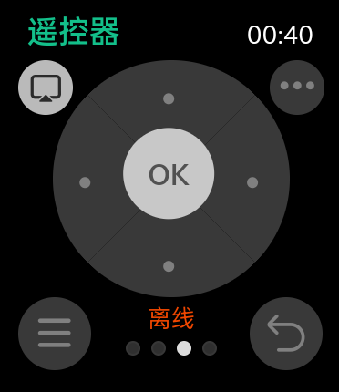

# 米居（miju）安卓手表版开源项目
「米居」For Watch，便捷操控你的米家智能家居~    

v2.0单设备控制版本，现已更新见右侧Releases处，后续版本会继续适配更多设备、更新操作手册、增加更多功能。   
⛔安装旧测试版本的用户，请卸载后再安装，喜欢v1.0简洁的朋友请下载v1.0版本使用。

代码目前处于还未完全修复，暂不公开，后续视情况会公开项目代码，项目无任何后面和数据回传，完全是基于接口的实现，请放心使用！

    
  

## 米居开源项目须知与声明
一. 本开源项目仅供个人学习交流使用，方便安卓手表端可以控制米家的智能家居。  
二. 本项目完全免费，可能存在较多漏洞，但本人能够正常使用。  
三. 本项目中所有适配的接口均来自小米公司（北京小米科技有限责任公司）旗下米家（MIJIA），本项目不对其控制的安全性负责。  
四. 本项目会将账户、密码、家庭信息等信息，缓存在软件本地，不含任何上传个人信息的接口。   
五. 真诚地希望小米官方能够推出 米家 For Watch，我也能用得上。   
六. 本项目仅供个人学习交流使用，切勿进行传播、任何形式的盈利，未涉及的问题请参见国家有关法律法规，以国家法律法规为准。

## 开发者及用户测试使用设备：
- 安卓手机设备
- OPPO Watch2 42mm（方形表盘）
- OPPO Watch2 46mm（方形表盘）
- OPPO Watch3（方形表盘）
- OPPO Watch3 Pro（方形表盘）
> 注：由于使用Uniapp开发，可能不支持不含webview的安卓设备和wearos设备，敬请谅解，后续如若更新架构则有望支持。

## 支持最低安卓版本（我并没有测试过该版本）：
- Android 4.4

## 各版本功能规划
#### 1. 我的米家：
- 家庭切换（对应的智能场景均会切换）
- 账户总设备在线数
- 家庭温湿度环境信息（需要在米家首页[环境模块]自行设置）

#### 2. 智能场景：
- 实现对智能场景的控制
- 在手机端米家首页即可增删改和排序智能场景（米家8.0请在首页最底部编辑中操作）

#### 3. 小爱指令（v3.0）：
- 需要家庭中至少有一个小爱音箱
- 发送指令，小爱音箱就会进行执行（包括红外指令，红外指令需要切换指定的小米音箱）
- 指令执行时，可以选择静默执行还是有回复执行（回复会由小爱音箱播放，默认静默执行，类似于小爱同学）
- 可以让小爱音箱朗读输入端文字

#### 4. 遥控器：
- 使用遥控器时，需要与要控制的小米电视/盒子在同一网络下
- 操控不同账户绑定的小米电视/盒子设备需要进行切换
- 支持按IP添加控制设备，控制IP需要在电视设置或路由器设备列表中找到（格式一般为192.168.X.X）

#### 5. 在线设备（v2.0）：
- 关于智能设备的获取、开关
- 特殊智能设备的多样化控制，如亮度、色温等
- 遥控器支持智能空调和红外线等设备（v2.5）
